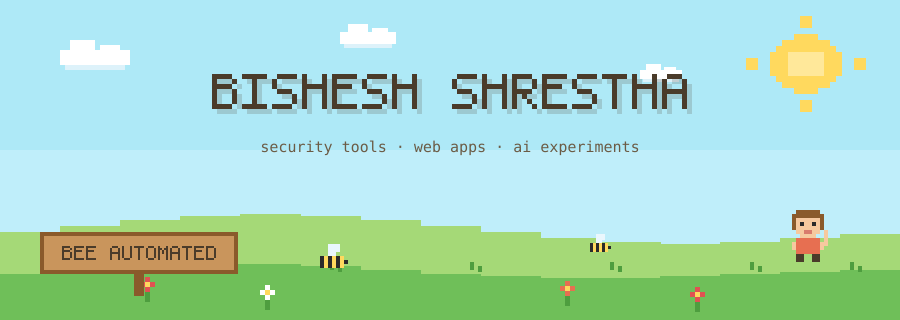
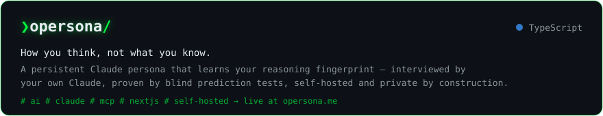
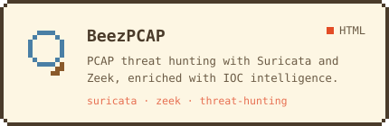
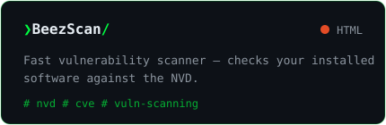
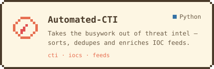
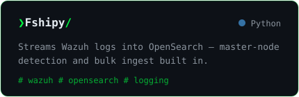
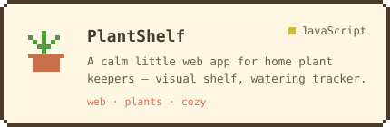
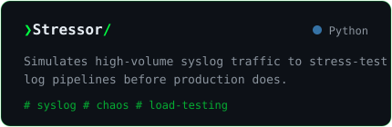
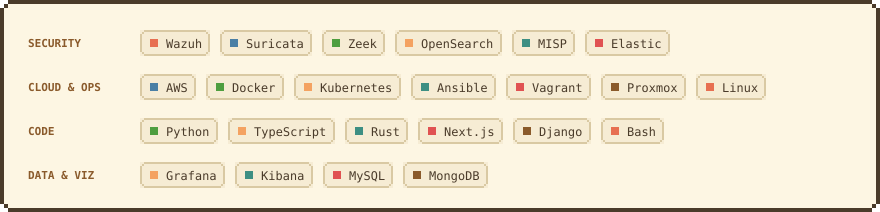

  

 

Hi! I'm a security engineer who likes making things — threat-intel pipelines and detection tools by trade, 
cozy web apps and AI experiments for fun. Most of it flies under the **[Bee Automated](https://bishesh-shrestha.com.np)** flag. 🐝

## Right now

**[Try it at opersona.me](https://opersona.me)** · [source](https://github.com/bishesh910/opersona)

## Projects

 

 

*…plus a few experiments still buzzing around in private hives.*

## Toolbox

## Bee activity

## Say hi

 

  

