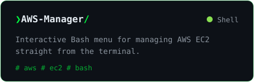

<div align="center">
  
</div>

<br>

<div align="center">

**[Bee Automated](https://bishesh-shrestha.com.np)** — *security automation in your hands.*

I build tools that hunt threats, break systems on purpose, and automate the boring parts out of existence.

</div>

---

## `~/now` — building opersona

> **How you think, not what you know.**

**[opersona](https://github.com/bishesh910/opersona)** gives every person on a team a **Pixie** — a persistent Claude persona that learns your *reasoning fingerprint*: how you break problems down, what you check first, when you push back. Your own Claude interviews you on claude.ai, blind prediction tests keep it honest, and everything runs self-hosted on your own subscription — your conversations never touch its server.

<div align="center">

<a href="https://github.com/bishesh910/opersona">
  
</a>

[](https://opersona.me)
[](https://github.com/bishesh910/opersona)

</div>

---

## `~/projects`

<div align="center">

<a href="https://github.com/bishesh910/BeezPCAP"></a>
<a href="https://github.com/bishesh910/BeezScan"></a>
<br>
<a href="https://github.com/bishesh910/Automated-CTI"></a>
<a href="https://github.com/bishesh910/Fshipy"></a>
<br>
<a href="https://github.com/bishesh910/Stressor"></a>
<a href="https://github.com/bishesh910/AWS-Manager"></a>

</div>

---

## `~/stack`

<div align="center">

**Security & Detection**


**Cloud & Ops**


**Code**


**Observability & Data**


</div>

---

## `~/stats`

<div align="center">


</div>

---

## `~/connect`

<div align="center">

[](https://np.linkedin.com/in/bishesh-shrestha-b05bb91a0)
[](https://medium.com/@bishesh404)
[](https://bishesh-shrestha.com.np)
[](https://buymeacoffee.com/bishesh910)


</div>

---

<div align="center">

```text
$ systemctl status bishesh
● bishesh.service — build tools · break systems · automate everything
     Active: active (running)
      Motto: "Chaos is not the enemy. Unpreparedness is."
```

*Things in my repos might be broken on purpose.*

</div>
